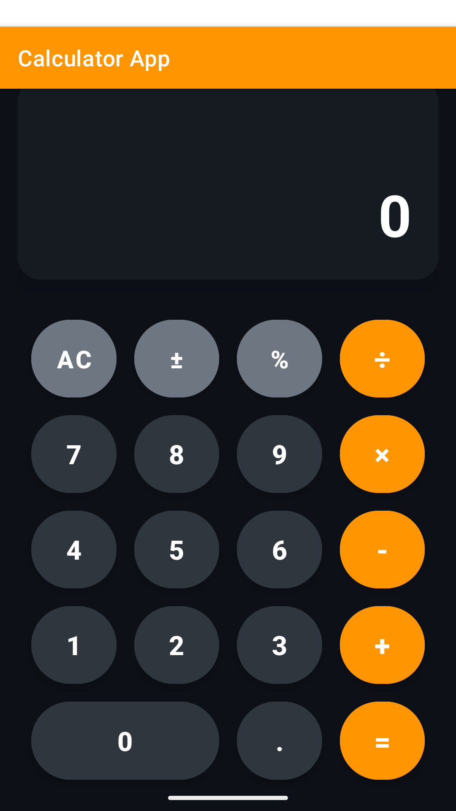

# 📱 Calculator App for Android

A modern, responsive calculator application built with Kotlin for Android.

## ✨ Features
- ✅ Basic arithmetic operations (+, -, ×, ÷)
- ✅ Percentage calculations
- ✅ Decimal point support
- ✅ Clear (AC) and Clear Entry (C) functions
- ✅ Positive/Negative toggle (±)
- ✅ Error handling for invalid inputs
- ✅ Modern Material Design UI
- ✅ Responsive layout
- ✅ Dark theme support

## 🎨 Screenshot


## 🚀 Installation

### Prerequisites
- Android Studio Giraffe or later
- Android SDK 24+
- Kotlin 1.8+

### Steps
1. Clone the repository:
```bash
git clone https://github.com/yourusername/calculator-app.git
